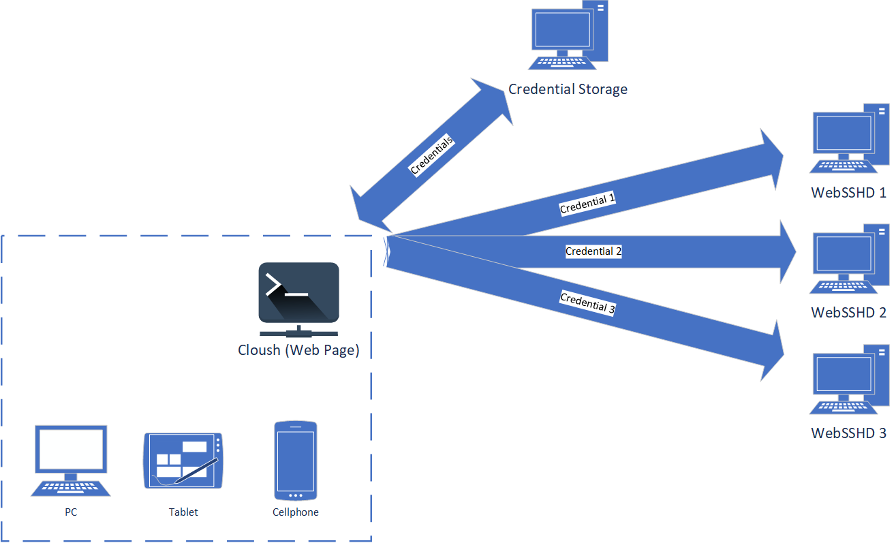

# Cloush


Cloush is basically a cross-platform SSH client on the cloud (or maybe not?) with distributed credential storage (see below for more details).

~~This project is meant to meet my own needs, other than those of anyone else.~~ I hope someone would like these projects, that is why I made them open-sourced. Pull/Feature requests are very much welcomed. However, implementation of new features is subject to my private schedule.

Note that this is only a client, you need to install [WebSSHD](https://github.com/Luluno01/web-sshd) on your servers, and you will need a [WebSSHD Credential Storage](https://github.com/Luluno01/web-sshd-credential-storage) server to manage your credentials.

## Highlighted Features

* Cross-platform: after setting up the credential storage, all you need is a modern Web browser
* Credential management: you can store all your credentials in a standalone credential storage server, without entering IP, port, user name and password manually every time
* Trustable credential storage: you run the credential storage server on your own, all credentials are in your own hand
* Ass-kicking user interface: of course it is, because I made it

## How It Works?

The idea is quite simple. First, I implementation a SSHD-like server that serves pseudoterminal processes via WebSocket using [node-pty](https://github.com/microsoft/node-pty) and [Socket.IO](https://socket.io/). Second, in order to manage credentials, a credential storage server is necessary (nothing special here). Finally, a client (it is a heavy work, really) that retrieves credentials from the credential storage and connect to target server running [WebSSHD](https://github.com/Luluno01/web-sshd) thereafter.

Okay, let's use a graph to explain the whole thing:



## Project setup

```bash
npm install
```

### Compiles and hot-reloads for development

```bash
npm run serve
```

### Compiles and minifies for production

```bash
npm run build
```

### Lints and fixes files

```bash
npm run lint
```

### Customize configuration
See [Configuration Reference](https://cli.vuejs.org/config/).
